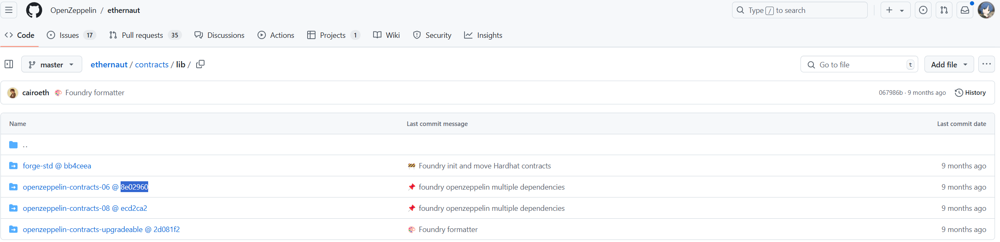

# 使用foundry完成ethernaut挑战

智能合约安全入门课程

https://ethernaut.openzeppelin.com/


## 准备：

直接clone本项目或者自己初始化一个

```
forge init Ethernaut-solution-by-foundry
```

目录结构：

```
├── foundry.toml
├── lib
│   └── forge-std
├── README.md
├── script    //题解合约
│   └── Counter.s.sol
├── src    //src为题目源码
│   └── Counter.sol
└── test  
    └── Counter.t.sol
```

库(lib)来自：
https://github.com/OpenZeppelin/ethernaut/tree/master/contracts/lib
在lib中clone 然后根据库分支来切换分支



例如：openzeppelin-contracts-06

```
cd lib 
git clone https://github.com/openzeppelin/openzeppelin-contracts
cp -r openzeppelin-contracts openzeppelin-contracts-06
cd openzeppelin-contracts-06
git checkout 8e02960
// 08同理
```


供参考的remappings.txt  (修改后重新进入编辑环境生效)

`forge remappings > remappings.txt`

```
@openzeppelin/=lib/openzeppelin-contracts/
@openzeppelin-06/=lib/openzeppelin-contracts-06/
@openzeppelin/contracts/=lib/openzeppelin-contracts/contracts/
@openzeppelin-08/=lib/openzeppelin-contracts-08/contracts/
ds-test/=lib/forge-std/lib/ds-test/src/
erc4626-tests/=lib/openzeppelin-contracts/lib/erc4626-tests/
forge-std/=lib/forge-std/src/
openzeppelin-contracts-06/=lib/openzeppelin-contracts-06/contracts/
openzeppelin-contracts-08/=lib/openzeppelin-contracts-08/contracts/
openzeppelin-contracts/=lib/openzeppelin-contracts/contracts/
```


供参考的foundry.toml

```
[profile.default]
src = "src"
out = "out"
libs = ["lib"]

remappings = [
    "@openzeppelin/=lib/openzeppelin-contracts/",
    "@openzeppelin-06/=lib/openzeppelin-contracts-06/",
    "@openzeppelin-08/=lib/openzeppelin-contracts-08/",
]
```


创建.env文件

```
#供参考的env文件
rpc='YourRpc'
# 一些可供使用的参考rpc节点  推荐使用holesky
# https://www.infura.io/
# https://www.ankr.com/
# https://blockpi.io/
# https://allthatnode.com
# .....


PRIVATE_KEY="0xYourPrivateKey"
MY_ADDRESS="YourAddress"
```

每次重新运行时执行来加载临时环境变量

```
source .env   
```


## Run

框架格式：

例如xx.s.sol

```
pragma solidity ^0.8.0;

import "forge-std/Script.sol";
import "forge-std/console.sol";
import "src/xx-xxx.sol";


contract Exploit {

}

contract Exp is Script {
    xxx public xxxInstance = xxx(payable(address));  //address为生成实例的合约实例地址
    address hacker = vm.rememberKey(vm.envUint("PRIVATE_KEY"));
    address owner = vm.envAddress("MY_ADDRESS");

    function attack() public {

    }

    function run() external {
        vm.startBroadcast(hacker);

        attack();

        vm.stopBroadcast();
    }
}
```

运行：

```
forge script script/xx.s.sol --evm-version cancun --rpc-url $rpc --tc Exp -vvvv --broadcast
```


## 一些wp参考

：https://piatoss3612.tistory.com/
：https://goodhacker.hashnode.dev/
：https://exp10it.io/2024/04/ethernaut-writeup/
